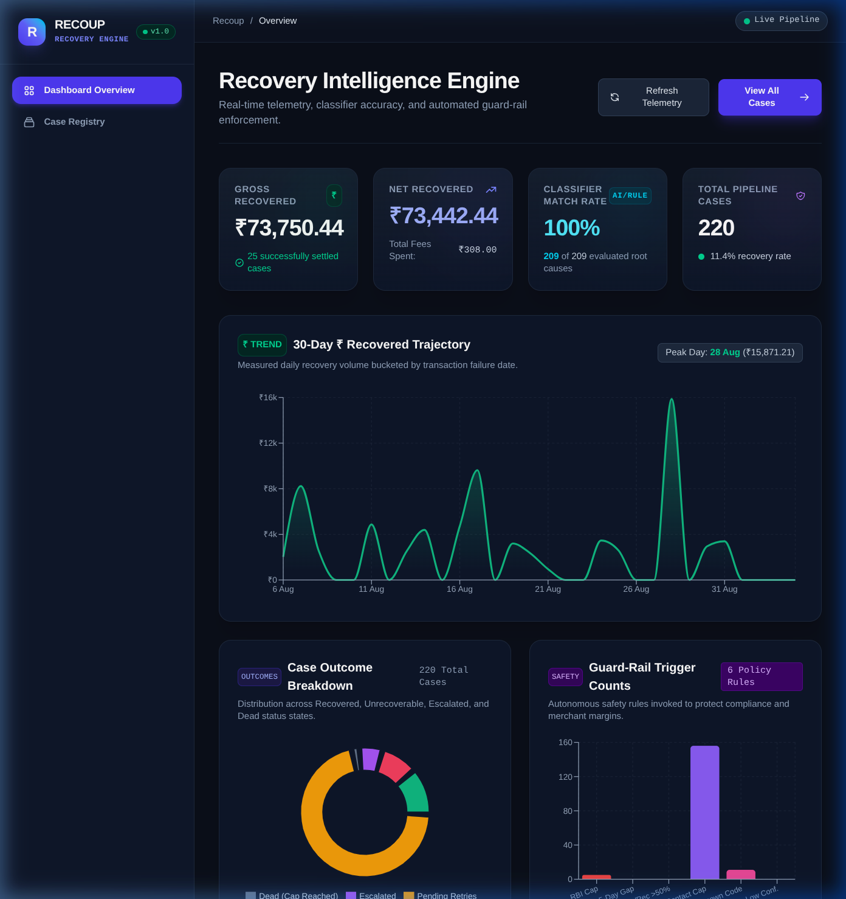
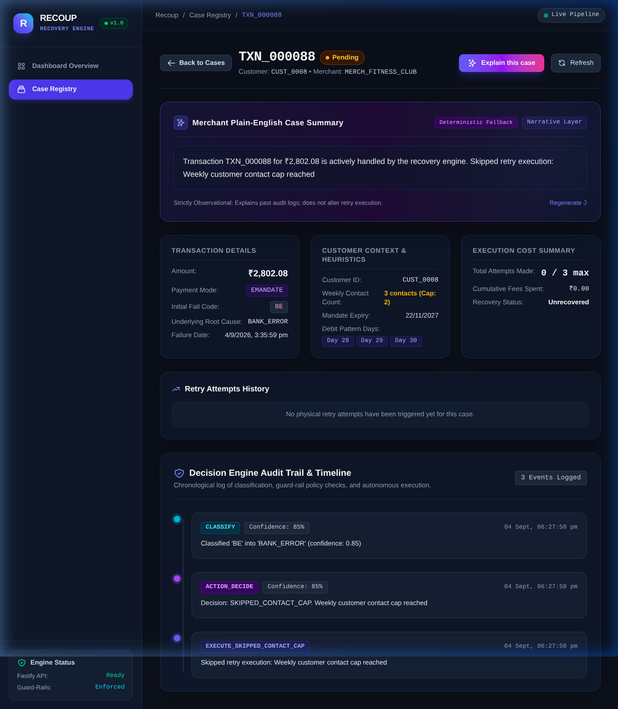

# Recoup: Deterministic Payment Recovery Engine

## The Problem
In emerging markets, digital payment failures (NACH, UPI, e-mandates) lead to massive revenue leakage. Standard retry logic is often blind, causing excessive gateway fees and violating customer contact caps.

## The Solution
Recoup is a deterministic, rule-based recovery engine that analyzes failure codes, enforces strict operational guard-rails (e.g., maximum weekly customer contacts), and autonomously executes retry strategies. 

## Architecture
- **Backend:** Fastify, TypeScript, Prisma, PostgreSQL (Supabase)
- **Frontend:** React 19, Vite, TailwindCSS, Recharts
- **Integrations:** Razorpay Node SDK (Test Mode API)

## AI-Discipline Rule: The Explainability Layer
To ensure financial compliance, AI is **strictly barred** from making retry decisions or influencing the deterministic execution path. Instead, the LLM is sandboxed purely as an *Explainability Layer*. It reads chronological, immutable audit logs generated by the deterministic engine and translates them into plain-English summaries for non-technical merchants.

## Screenshots

*View of the recovery analytics and guard-rail trigger metrics.*

*Transaction audit log alongside the LLM-generated plain-English execution summary.*

## Local Setup
1. Clone the repository and run `npm install`.
2. Configure `.env` with required environment variables:
   - `DATABASE_URL` — Supabase dashboard (pooled connection string)
   - `DIRECT_URL` — Supabase dashboard (direct connection string)
   - `RAZORPAY_TEST_KEY_ID` — Razorpay Test Mode dashboard
   - `RAZORPAY_TEST_KEY_SECRET` — Razorpay Test Mode dashboard
   - `ANTHROPIC_API_KEY` — Anthropic console
3. Run `npm run seed` to populate dummy transactions.
4. Run `npm run dev` in both `packages/backend` and `packages/frontend`.
